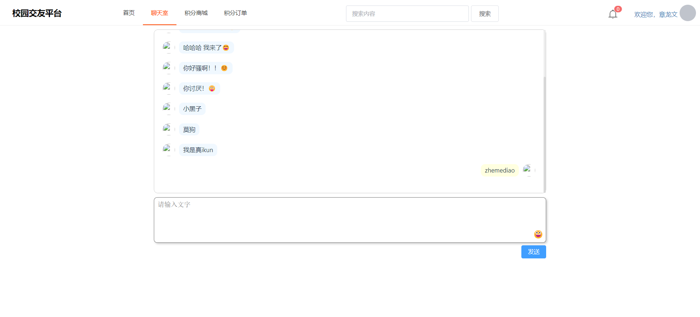
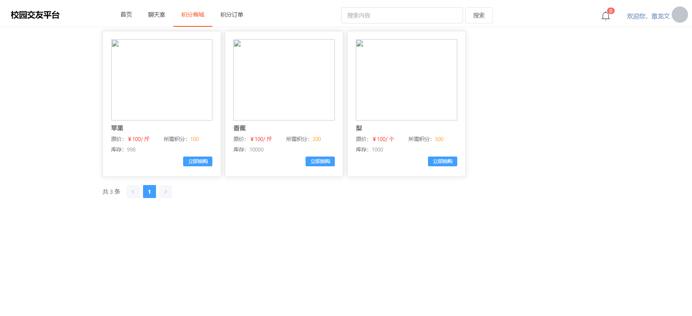
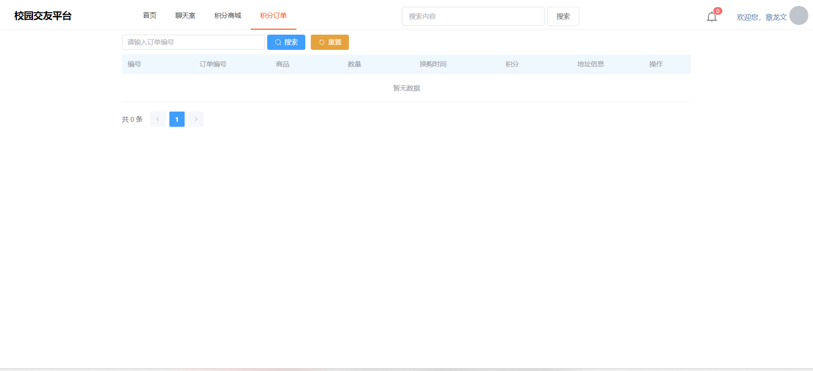
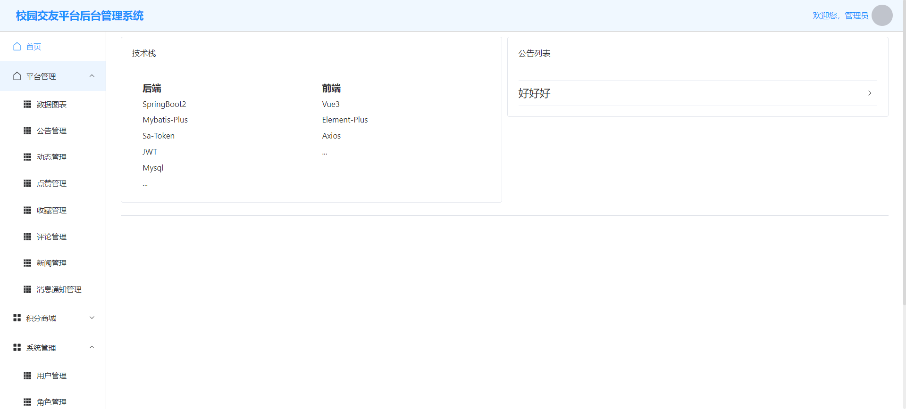

# club-management

#### 介绍
本设计的特点在于其丰富的功能和创新的积分模式。包括聊天、动态发布、点赞、收藏等功能，使用户可以轻松地与他人进行交流和互动。聊天功能允许用户通过文字、表情多种形式进行交流，增强了交友的趣味性和真实性。动态功能则为大学生们提供了一个分享观点、交流学习经验、分享生活的平台，有助于促进知识的传播和思想的碰撞。而且大学生交友平台为大学生们提供了一个便捷的交友途径，促进了校园文化的繁荣和社交活动的发展。未来，随着技术的不断进步和用户需求的不断变化，大学生交友平台将会继续创新和完善，为大学生们提供更加优质、丰富的交友体验。**有偿获得完整源码+Q：2369303335**

#### 软件架构
软件架构说明

#### 安装教程

1. 运行环境准备mysql8+jdk1.8+npm16.9.1+redis3

2. 配置maven路径，加载依赖

   

3. 运行sql文件，确保application.yml的数据库名称和账号密码是数据库所在主机的账号密码

#### 使用说明

1. 登入

   账号：admin	密码：123456
   账号：zlw	密码：123456

2. xxxx

3. xxxx

#### 项目演示

+ 首页页面

+ 聊天室页面

+ 积分商城页面

+ 积分订单

+ 管理员页面

#### 参与贡献

1.  Fork 本仓库
2.  新建 Feat_xxx 分支
3.  提交代码
4.  新建 Pull Request

#### 特技

1.  使用 Readme\_XXX.md 来支持不同的语言，例如 Readme\_en.md, Readme\_zh.md
2.  Gitee 官方博客 [blog.gitee.com](https://blog.gitee.com)
3.  你可以 [https://gitee.com/explore](https://gitee.com/explore) 这个地址来了解 Gitee 上的优秀开源项目
4.  [GVP](https://gitee.com/gvp) 全称是 Gitee 最有价值开源项目，是综合评定出的优秀开源项目
5.  Gitee 官方提供的使用手册 [https://gitee.com/help](https://gitee.com/help)
6.  Gitee 封面人物是一档用来展示 Gitee 会员风采的栏目 [https://gitee.com/gitee-stars/](https://gitee.com/gitee-stars/)

有偿获得源码+Q：2369303335
