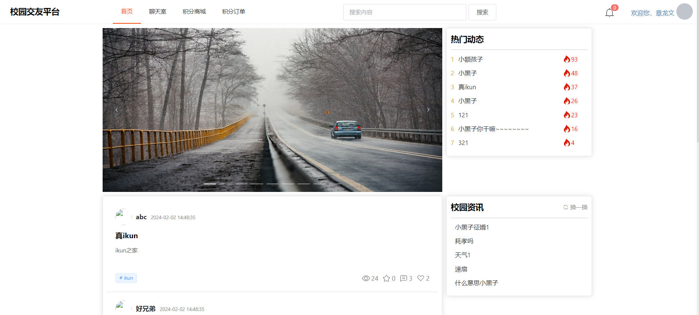
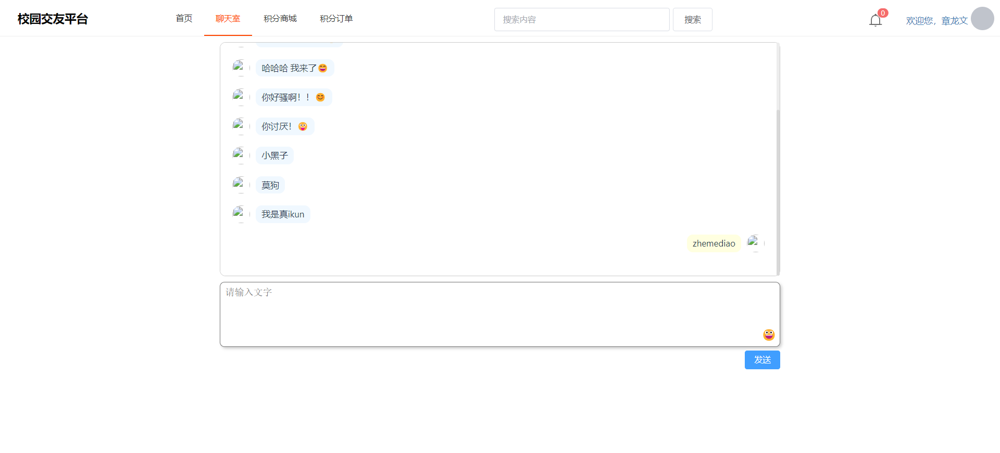
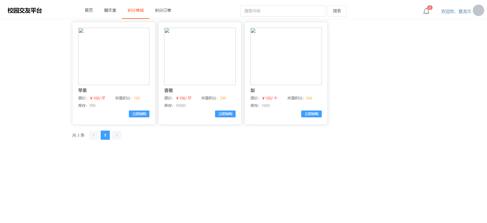
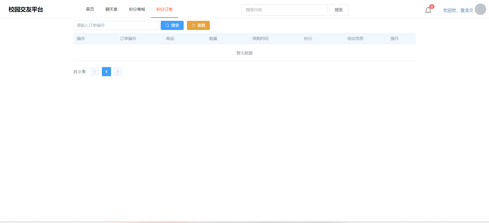
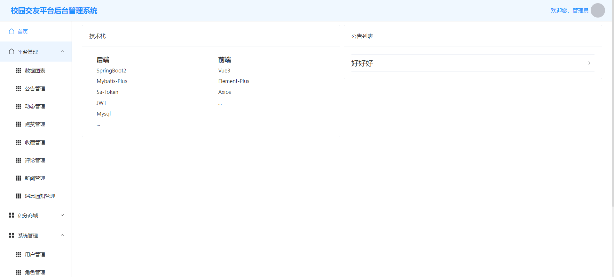

# college-student-friendship🎂

基于Springboot+Vue的大学生交友平台

## 介绍🌞

> 本设计的特点在于其丰富的功能和创新的积分模式。包括聊天、动态发布、点赞、收藏等功能，使用户可以轻松地与他人进行交流和互动。聊天功能允许用户通过文字、表情多种形式进行交流，增强了交友的趣味性和真实性。动态功能则为大学生们提供了一个分享观点、交流学习经验、分享生活的平台，有助于促进知识的传播和思想的碰撞。而且大学生交友平台为大学生们提供了一个便捷的交友途径，促进了校园文化的繁荣和社交活动的发展。未来，随着技术的不断进步和用户需求的不断变化，大学生交友平台将会继续创新和完善，为大学生们提供更加优质、丰富的交友体验。

## 项目演示🌞

+ 首页页面




+ 聊天室页面




+ 积分商城页面




+ 积分订单




+ 管理员页面




## 安装教程🌞

```
1. 运行环境准备mysql8 + jdk1.8 + node16.9.1 + redis3

2. 配置maven路径，加载依赖

3. 运行sql文件，确保application.yml或config.properties的数据库名称和账号密码是数据库所在主机的账号密码
```

## 使用说明🌞

```
1. 登入

   账号：admin	密码：123456
   账号：zlw	密码：123456

2. 运行流程

SpringBoot+Vue项目的部署详情可以查看这篇CSDN博客：http://t.csdnimg.cn/kpuxS

前后端不分离项目的部署流程可以查看这篇CSDN博客：http://t.csdnimg.cn/CslA5
```


## CSDN项目合集🌞

点击前往：http://t.csdnimg.cn/Q4u84


## 联系我🌞

**有偿获取完整源码或调试代码**

🐧：1902317191

we-chat：coding1902317191
